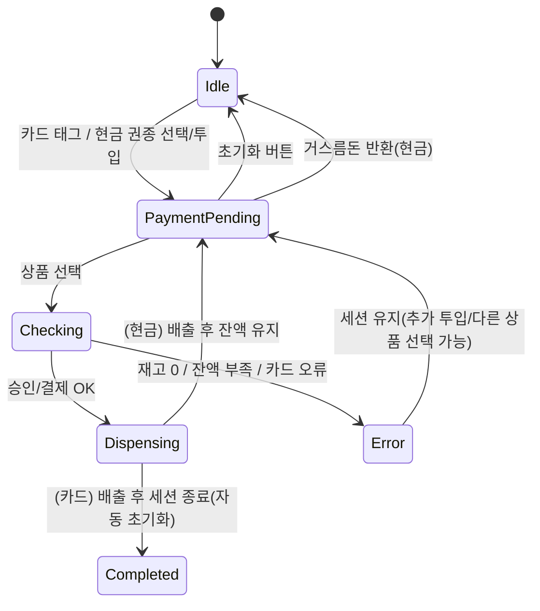

# Jeongmin Vending Machine (React + TypeScript)

간단하지만 **평가 기준**을 의식해 설계한 자판기 예제입니다.  
현금 **잔액으로 연속 주문** 후 마지막에 **거스름돈 반환**으로 종료하는 흐름을 구현합니다.  

> 핵심 파일: `src/components/VendingMachine.tsx`

---

## ⚙️ 실행 방법 & 버전

### 요구 버전
- **Node.js**: 18 ver 이상 권장
- **npm**: 9 ver 이상
- OS: Windows / macOS / Linux

### 설치 & 실행
```bash
# 의존성 설치
npm install        # 또는: pnpm install / yarn

# 개발 서버
npm run dev

# 프로덕션 빌드
npm run build

```

> Vite 기반 React-TS 표준 템플릿을 가정합니다. 다른 빌드 도구를 사용한다면 스크립트 명령만 치환하세요.

---

## 🧩 동작 개요 (State Machine)



### 핵심 UX
- **현금**: `insertedTotal`에 투입 → 구매 시 가격만큼 차감 → **계속 구매 가능** → 마지막에 “거스름돈 반환”으로 종료.
- **카드**: 선택-구매 성공 시 **1회성**으로 완료(자동 Reset). 실패는 **토글(cardError)** 로만 시뮬레이션(랜덤 없음).
- **오류**: 재고/잔액/카드 오류 발생 시 **세션 유지**하여 사용자 행동 여지 제공.

---

## 🧠 에지 케이스(발생 가능한 케이스) 처리

- **재고 없음**: 상품 버튼 자동 비활성화 + 선택 시 오류 후 **세션 유지**.
- **잔액 부족(현금)**: 오류 메시지 후 **세션 유지**(추가 투입 유도).
- **카드 오류**: **체크박스 토글**로 명시(랜덤 X). 오류 시 안내 후 **자동 초기화**.
- **배출 중 반복 클릭**: `isBusy` 플래그로 입력 잠금(Checking/Dispensing 동안 버튼 비활성화).
- **음수 재고 방지**: `Math.max(0, s[drink] - 1)` 가드.
- **결제 방식 전환**: 선택된 방식과 다른 UI는 **잠금**(`isPaymentControlDisabled`). 필요 시 “잔액 0일 때 전환 허용”으로 변경 가능.

---

## 🧱 코드 구조 & 스타일

- **기술 선택**
  - React + TypeScript: 타입 안전성과 생산성
  - 외부 상태관리/라우팅/디자인 시스템 없이 **단일 컴포넌트**로 데모 목적에 집중
- **네이밍 & 분해**
  - 프리디케이트 네이밍: `isPaymentControlDisabled`, `canReturnChange`, `isBusy`
  - 액션 핸들러: `onCardTag`, `onCashSelect`, `onInsertCash`, `onReturnChange`, `handleBuy`, `dispense`
  - 상태: `state`, `method`, `insertedTotal`, `message`, `stock`, `selectedDenom`, `cardError`
- **상태 업데이트 스타일**
  - 가격 차감/잔액 증가 등은 **함수형 업데이트**(`setX(prev => next)`) 사용해 경쟁 상태 방지
- **UI 구성**
  - 인라인 스타일 기반 **사각형 박스**(미니멀), 재사용 가능한 스타일 객체로 일관성 유지(`ui.box`, `ui.btn`, `ui.radio` 등)

### 폴더 구조(예시)
```
src/
├─ components/
│  └─ VendingMachine.tsx
├─ App.tsx
└─ main.tsx
```

---

## 🔍 테스트 가이드(수동)

1) **현금 결제**  
   - 1,000원 선택 → 투입(1장) → 잔액 1,000원 표시 확인  
   - 콜라(1,100) 선택 → 잔액 부족 오류 → 100/1,000 투입 → 성공 시 잔액 차감 확인  
   - 두 잔 이상 연속 구매 후 **거스름돈 반환** 버튼으로 종료

2) **카드 결제**  
   - 카드 태그 → 상품 선택 → 배출 후 자동 초기화 확인  
   - **카드 오류 토글 ON** → 다시 구매 시 오류 표시 + 초기화 확인

3) **재고**  
   - 특정 음료 재고를 0으로 설정 → 버튼 비활성/오류 처리 확인

---

## ♿ 접근성 & i18n

- 텍스트 기반 버튼/라벨, 상태 메시지 실시간 표기
- 숫자 포맷은 `toLocaleString("ko-KR")`로 로케일 일관성
- 필요 시 `title`/aria 속성 및 다국어 리소스 분리 가능

---

## ⚠️ 알려진 한계 & 확장 아이디어

- 로컬 상태만 사용(서버/결제 연동 없음) → 실제 서비스는 API/동시성/보안 고려 필요
- **자동 반환 타이머**(무입력 N초) 추가 가능
- **거스름돈 동전 분해**(500/100 최소 개수) 표시 가능
- 스타일 시스템(Tailwind/shadcn)로 이식 가능

---

## 📦 .gitignore(권장)

```
node_modules/
dist/
build/
.env
.env.*
.DS_Store
*.log
```

---

## 📝 라이선스

MIT — 자유롭게 수정/사용하세요.
